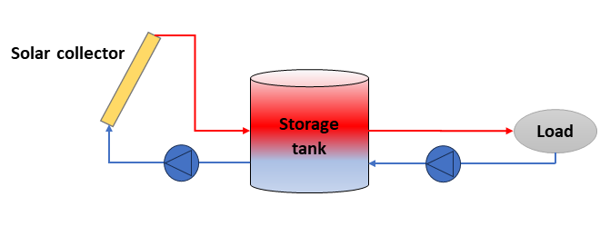
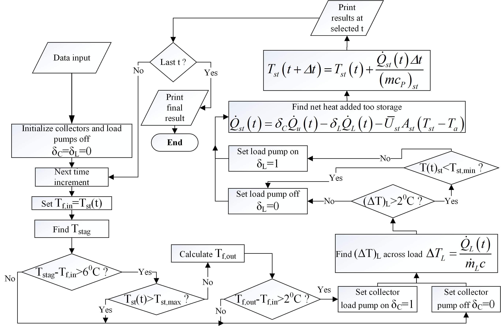

# SOLTHES - SOLar THErmaL SySTEmS EducaTiOnaL Software

## Description
SOLTHES is an in-house MATLAB® code designed to simulate typical solar thermal systems and provide insights into their performance and energy efficiency. It is based on the model provided by the book of J.R. Howell [1] and it has been developed as a part of the post-graduate course "Solar Thermal Systems" at the University of Thessaly [2]. A typical solar thermal system, presented in Fig. 1, consists mainly of the solar collector, the storage tank, and the load. Depending on the application, other components such as heat exchangers, pumps, and control sensors, etc may also be present. SOLTHES simulates a typical solar thermal system throughout a whole year by taking weather data from either a typical meteorological year (TMY) [3] file or a comma separated values (CSV) file generated by the PVGIS online tool [4]. A graphical interface unit (GUI) version of the code as well as a standalone MATLAB app created from the GUI version of the code are provided in order to help potential users simulate a typical solar thermal system with no programming experience.

Figure 1: Typical solar thermal system 

## Features

The software is specifically designed to provide a comprehensive tool for students to simulate and analyze the performance of various solar thermal systems. It simulates a range of solar thermal systems, including applications such as solar heating and solar domestic hot water, and can model different types of solar collectors, e.g., flat-plate and evacuated-tube collectors. It includes a range of customizable parameters, such as the solar radiation intensity and ambient temperature, which can be adjusted to reflect different environmental conditions. The software outputs detailed performance metrics, such as the thermal efficiency, energy output, and system losses, which can be used to optimize the design and operation of solar thermal systems.

In each time step, the temperatures for the different subsystems are computed as the simulation advances in time. An ordinary differential equation describing the temperature in the storage tank is solved in the main computation loop. The main loop also includes the control of the system, the interpolation for the solar radiation and the ambient temperature, as well as the load and other quantities calculation. At the present stage of the software the available type of loads include the space heating and domestic hot water loads and are provided in kW.

Also, the program includes a parametric analysis for the collector area $A$ and the storage volume $V_{st}$, which are the main parameters for sizing a solar thermal system.

Furthermore, the control for the typical solar thermal system is seen in Fig. 2. The circuit for the solar collector opens or closes depending on the environmental conditions and the available heat that it can provide to the storage tank. Similarly, when the available heat from the storage tank to the load is enough, then the load circuit opens and it covers the load. Extra controls include the check for the stagnation and maximum temperatures in the collector circuit. More information on the model and the control of the solar thermal system may be found in [1].

In addition, a graphical interface unit (GUI) is provided with the SOLTHES software. The GUI was created with the APP designer from MATLAB software and it involves the same functionalities as the source code. The GUI version is also compiled to a standalone app in order for users with no programming experience to be able to test the program and simulate a typical solar thermal system. 

A Python module for receiving the weather data through an API of the PVGIS webtool is also included. The user may easily put the latitude and longitude of the site and then the csv file with the weather data is downloaded in the data folder.

Figure 2: The flow chart of SOLTHES

## Running SOLTHES and SOLTHESS app

### Installation and usage

To install the software, simply download the code files from the Github repository and extract them to a directory on your computer. The software requires MATLAB® to run the code.
The software has been tested on MATLAB® '9.14.0.2337262 (R2023a) Update 5', however it is possible to run even in older versions of MATLAB®. To run the software, open MATLAB® and navigate to the directory where the code files are located. Then, run the main file **SOLTHES_main.m** to start the simulation. Before running the software, it is necessary to alter the inputs in the **SOLTHES_main.m** file such as the solar collector type, size, location, and orientation, as well as the storage tank size and temperature settings. It is also critical to put the weather data into the data folder with the correct name in the folder and the **solar_data.m**. Weather files in csv or tmy form can be found in [4,6]. Once the inputs are entered, the user will run the software and then the software will prompt the user to choose the output of the results in a user-friendly format.

The GUI version of the software may be easily executed by opening **Solthes_App.mlapp** in the src folder provided that a MATLAB distribution is provided.

To install and use the standalone app (Windows only), there are two ways to do it. If a MATLAB runtime is installed, then use directly the **Solthes_App.exe** from the Solthes_App/for_redistribution_files_only folder. If there is no MATLAB runtime installed, then run the **Solthes_installer_web.exe** Solthes_App/for_redistribution_files_only folder to install the suitable MATLAB runtime along with the app. Then, the user may open the **Solthes_App** from the Desktop shortcut. 

### Input Data

The input data include:
-   Collector: heat transfer coefficient $U$ in $\text{W/(m}^2 \text{K})$, $\tau\alpha_{eff}$, $F_{R}$, slope $\beta$,
    surface azimuth angle $\gamma$, diffuse reflectance ${{\rho }_{r}}$.

-   Storage: heat transfer coefficient $U_{st}$ in $\text{W/(m}^2 \text{K})$, length to
    diameter ratio $L_{st}/R_{st}$, initial 
    $T_{st,initial}$ and maximum $T_{st,max}$ temperatures in  $\text{K}$.

-   Space heating load: degree-hour method
    $\dot{L}=U_{house}A_{house}(T_{b}-T_{a})$
    in $\text{Whr}$, building loss coefficient $U_{house}$ in 
    $\text{W/(m}^2 \text{K})$, area of the building envelope
    $A_{house}$ in $\text{m}^2$, balance point temperature
    $T_{b}$ in $^{\text{0}}\text{C}$, minimum temperature to cover
    load $T_{l,min}$ in $\text{K}$ and mass flow rate of the load
    $m_{l}$ in ${\text{kg}}/{\text{s}}$.

-   Domestic hot water: consumption in lt per person per day at
    a temperature in $^{\text{0}}\text{C}$. Profile of the hourly consumption given as a
    percentage of the total consumption, supply temperature in
    $^{\text{0}}\text{C}$.

The time step is 1 min and the output data are provided every 60 minutes.

### Post-processing
The software prompts the user for plotting some or all the results: the storage temperature (TST), the ambient temperature (TA), the collector switch (DC), load switch (DL), useful energy gain (QU), efficiency (N_A), thermal load (QL). Also, a xls file is generated for doing data analysis with spreadsheet programs.

## Tutorial Case
The software is set up to run a tutorial case for two different sets of weather data. The first one is an example csv file for Athens generated by the PVGIS [4] and the other one is a TMY2 file named "US-NY-New-York-City-94728.tm2" which is not placed at the folder but it can be found at [5]. Extra weather files in csv or tmy form can be found in [4,5]. The other data (collector, storage, load) are the same as in the validation case described in the validation folder. 

## Future work

## Limitations
The software is designed to simulate typical solar thermal systems, and may not accurately represent systems with unique configurations or non-standard components. Additionally, the accuracy of the simulation results may be affected by factors such as the quality of the input data and the assumptions made in the simulation model.

## Contact
If you have any questions, feedback, or issues with the software, please contact:

Alexandros Tsimpoukis,
University of Thessaly,
atsimpoukis@mie.uth.gr 

## References:
1. [J. R. Howell, R. B. Bannerot, G. C. Vliet, Solar-Thermal Energy Systems: Analysis and Design, McGraw Hill, 1982](https://www.amazon.com/Solar-Thermal-Energy-Systems-Analysis-Design/dp/0070306036 "Go to book")
2. [D. Valougeorgis and A. Tsimpoukis, Solar Thermal Systems, Post-graduate course, Program of Studies entitled "Analysis and Management of Energy Systems", University of Thessaly, Greece. (in Greek)](http://www.mie.uth.gr/n_one_mathima.asp?id=163&cat=1&tp= "Go to course")
3. [W. Marion, K. Urban, S, Wilcox and W. Marion, W. User's Manual for TMY2s, NREL, 1995](https://www.nrel.gov/docs/legosti/old/7668.pdf "Go to Manual")
4. [Joint Research Centre, PVGIS Online Tool, European Commission, 2023](https://re.jrc.ec.europa.eu/pvg_tools/en/tools.html "Go to website")
5. [NSRDB: National Solar Radiation Database, Data viewer, NREL, 2023](https://nsrdb.nrel.gov/data-viewer "Go to website")

